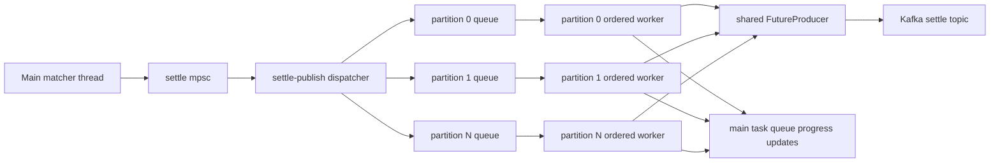

# Publish performance optimization

This document records the current downstream publish design after the settle
path was optimized for a multi-partition Kafka topic. The implementation lives
mainly in [`src/publish.rs`](../src/publish.rs), with configuration loaded from
[`config.yaml`](../config.yaml) through [`src/config.rs`](../src/config.rs).

## Goals

- Keep the matcher main thread single-owner for `Market`.
- Push the `settle` topic quickly across many partitions.
- Preserve strict ordering within each settle partition.
- Let different settle partitions advance independently.
- Avoid compatibility shims for older flat `output_publish` or optional settle
  idempotence configuration.

`quote_deals.<market>` remains a separate producer path. The optimization here
is focused on `settle`, whose messages are explicitly partitioned by user group.

## Previous bottleneck

Settle messages already had a stable partition key:

- `Market::settle_group_id(user_id)` maps a user to one of
  `USER_SETTLE_GROUP_SIZE` groups.
- `Market::next_settle_message_id(user_id)` increments a per-group
  `settle_message_id`.
- `enqueue_settle_publish` writes to the Kafka `settle` topic with
  `.partition(group_id)`.

The old publish loop collected a batch from one `std::sync::mpsc::Receiver`,
enqueued all messages in that batch, and then waited for all delivery futures in
that batch before processing the next batch. This allowed some concurrency
inside one batch, but a slow partition could hold the whole settle publish loop
back, including unrelated partitions.

## Current architecture

The settle publish thread now acts as a dispatcher. It owns one Tokio runtime
and one shared Kafka `FutureProducer`, creates one async worker queue per settle
group, then forwards each `SettlePublishTaskInfo` to the worker for its
`group_id`.

Each partition worker processes its queue sequentially:

1. Drop already-pushed messages whose `settle_message_id` is not greater than
   the worker's local pushed cursor.
2. Enqueue the message to Kafka using the worker's partition id.
3. Await the delivery future.
4. Decrement publish backlog.
5. Send `Task::SettleProgressUpdateTask` back to the main thread.
6. Advance the worker's local pushed cursor.

Different workers run independently on the settle publish runtime, so one slow
partition no longer blocks other partitions from sending and confirming.



## Ordering model

Ordering is guaranteed at the application layer by the per-partition worker:

- There is exactly one worker queue per `group_id`.
- A worker awaits the Kafka delivery result before it sends progress for that
  message and before it processes the next queued message.
- `pushed_settle_message_ids[group_id]` is updated only by the main thread after
  receiving `Task::SettleProgressUpdateTask`.

This keeps the persisted progress model simple: a pushed cursor means every
settle message up to that id for the same group has been delivered.

The design intentionally does not implement out-of-order per-partition delivery.
If a future version allows multiple in-flight messages per partition and accepts
out-of-order acknowledgements, progress cannot be represented by a single cursor
alone. It would need gap tracking, such as a contiguous cursor plus a bitmap or
set of acknowledged ids above the cursor.

## Kafka producer settings

`output_publish` is now split by producer:

```yaml
output_publish:
  quote:
    batch_size: 1024
    linger_ms: 10
    max_in_flight_requests_per_connection: 1
  settle:
    batch_size: 256
    linger_ms: 50
    max_in_flight_requests_per_connection: 5
```

Settle publishing always enables Kafka idempotence and `acks=all` in code. There
is no `settle.enable_idempotence` flag anymore.

Configuration meanings:

| Field | Scope | Effect |
| --- | --- | --- |
| `batch_size` | Application batch collection and librdkafka `batch.num.messages` | Caps how many publish tasks the dispatcher drains per loop and how many messages librdkafka may place in one broker batch. |
| `linger_ms` | Kafka producer batching | Lets librdkafka wait briefly for nearby records before sending a broker batch. Lower values reduce latency; higher values may improve throughput. |
| `max_in_flight_requests_per_connection` | Kafka producer connection | Limits unacknowledged produce requests per broker connection. Settle must stay `<= 5` because idempotence is always enabled. |

Because settle workers serialize each partition at the application layer,
`max_in_flight_requests_per_connection` mainly controls cross-partition and
broker-level concurrency, not per-partition reordering.

## Thread model impact

The process still has one OS thread named `settle-publish`. Inside it, the
settle Tokio runtime uses a small worker pool and runs the dispatcher plus
per-partition async tasks. These are not additional OS threads per partition.

The Kafka producer handle still owns its own librdkafka native threads for broker
I/O, polling, and protocol work. See [`doc/thread-model.md`](thread-model.md)
for the broader process thread model.

## Tuning guidance

Start with the current safe defaults:

- `settle.max_in_flight_requests_per_connection: 5`
- `settle.linger_ms: 50`
- `settle.batch_size: 256`

For lower latency, reduce `settle.linger_ms` first, for example to `10` or `5`.
For a conservative ordering experiment, set
`settle.max_in_flight_requests_per_connection: 1`; this may reduce throughput
but also reduces broker connection concurrency.

Use profiling before and after each change. The useful HTTP signals are:

- `/markets/{market}/status`: compare `pushed_settle_message_ids` against the
  settle message ids and watch per-group lag.
- `/markets/{market}/summary`: confirm the order book is not stalled while
  publishing catches up.

## Verification checklist

- `cargo check`
- `cargo test`
- Run the engine and confirm `/markets/{market}/status` shows
  `pushed_settle_message_ids[group_id]` advancing monotonically.
- Profile with `matchengine-xctrace-profile` and compare:
  - settle publish lag at the end of the run,
  - CPU in `settle-publish`,
  - librdkafka broker thread weight,
  - HTTP poll success window.

Expected behavior after the optimization:

- A slow or unavailable settle partition only grows that partition's backlog.
- Other settle partitions continue to deliver and update progress.
- The main matcher thread remains the only owner of `Market`.
- Recovery can still rely on one contiguous pushed cursor per settle group.
