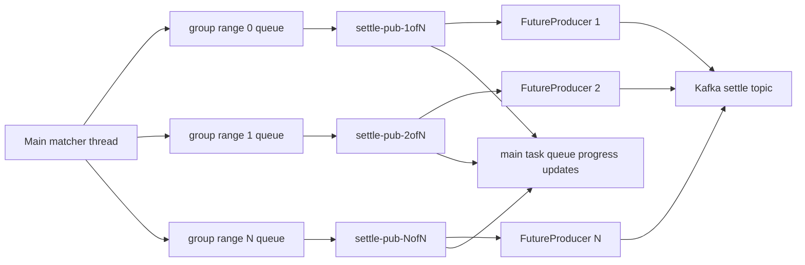

# Publish performance optimization

This document records the current downstream publish design after the settle
path was optimized for a multi-partition Kafka topic. The implementation lives
mainly in [`src/publish.rs`](../src/publish.rs), with configuration loaded from
[`config.yaml`](../config.yaml) through [`src/config.rs`](../src/config.rs).

## Goals

- Keep the matcher main thread single-owner for `Market`.
- Push the `settle` topic quickly across many partitions.
- Preserve strict ordering within each settle partition.
- Let different settle partitions advance independently.
- Avoid compatibility shims for older flat `output_publish` or optional settle
  idempotence configuration.

`quote_deals.<market>` remains a separate producer path. The optimization here
is focused on `settle`, whose messages are explicitly partitioned by user group.

## Previous bottleneck

Settle messages already had a stable partition key:

- `Market::settle_group_id(user_id)` maps a user to one of
  `USER_SETTLE_GROUP_SIZE` groups.
- `Market::next_settle_message_id(user_id)` increments a per-group
  `settle_message_id`.
- `enqueue_settle_publish` writes to the Kafka `settle` topic with
  `.partition(group_id)`.

The old publish loop collected a batch from one `std::sync::mpsc::Receiver`,
enqueued all messages in that batch, and then waited for all delivery futures in
that batch before processing the next batch. This allowed some concurrency
inside one batch, but a slow partition could hold the whole settle publish loop
back, including unrelated partitions.

## Current architecture

Settle publishing now runs a configured number of OS workers
(`output_publish.settle.thread_count`). The main thread sends each
`SettlePublishTaskInfo` directly to the worker responsible for that `group_id`.
Each worker owns an equal-sized contiguous range of settle groups, owns an
independent Kafka `FutureProducer`, and keeps a bounded set of delivery futures
in flight on the same OS thread.

Core invariant for settle: **a group is a partition**, and groups are independent.
Ordering, batching, outstanding permits, acknowledgement gaps, and pushed cursors
are all tracked per `group_id`. There is no global settle ordering. The
worker-level outstanding window caps each worker's aggregate in-flight records
across its groups.

Each settle worker processes its assigned groups with a per-group pipelined
scheduler:

1. Require each `group_id` to receive strictly increasing `settle_message_id`
  values above that group's scheduled cursor.
2. Keep a separate pending queue for each `group_id`, and rotate ready groups
  through a fair queue while that group's own `max_outstanding` window still has
  capacity.
3. Enqueue at most `per_group_send_burst` records for one `group_id` per
  scheduling turn. If that group still has queued work and delivery-window
  capacity, put it back at the end of the ready queue so other ready groups can
  enqueue before the hotspot continues.
4. Await whichever delivery future completes next.
5. Track out-of-order acknowledgements per group, advance that group's local
  pushed cursor only across contiguous acknowledged ids, decrement publish
  backlog, and coalesce progress updates to the main thread on the configured
  progress flush interval.

Different workers run independently as plain OS threads, and different groups
inside a worker can still be in flight concurrently. A slow partition only holds
that partition's next batch; it does not block other partitions' queues,
outstanding windows, or progress cursors.



## Ordering model

Ordering is guaranteed at the application layer by the group-to-worker mapping:

- Each `group_id` is always sent to the same worker queue.
- The main thread sends messages for a `group_id` in settle id order.
- A worker sends at most one in-flight batch for the same `group_id`; the next
  queued batch for that group is scheduled only after all deliveries in the
  current batch are acknowledged.
- Different groups may be in flight at the same time, with each group's delivery
  futures bounded independently by `settle.max_outstanding`.
- `pushed_settle_message_ids[group_id]` is updated only by the main thread after
  receiving `Task::SettleProgressBatchUpdateTask`; publish threads batch per-group
  progress into one task per flush at most once per second.

No partition waits for another partition's acknowledgement before starting or
advancing its own batch. Cross-partition progress reports may share one task for
main-queue efficiency, but the values inside that task remain independent
per-group cursors.

This keeps the persisted progress model simple: a pushed cursor means every
settle message up to that id for the same group has been delivered. A worker may
temporarily hold acknowledged ids above the cursor until the missing lower id
arrives.

The allowed-duplicate boundary is application-side only: this code will not send
the same `settle_message_id` to Kafka a second time, while Kafka producer
idempotence only deduplicates retries within the same producer lifecycle and
does not provide downstream exactly-once semantics.

### Broker-side ordering with `max_in_flight_requests_per_connection = 5`

The settle producer is created with `enable.idempotence = true`. In this mode
every message carries a `(ProducerID, partition, sequence_number)` triple.
The broker accepts and orders messages by that sequence number, and rejects
any write that would create a gap or duplicate—even if several request batches
are in flight at the same time.

This means `max_in_flight_requests_per_connection = 5` does **not** cause
consumer-visible reordering. Without idempotence, a retry after a transient
failure can arrive after a newer batch has already committed, interleaving
physical log order with send order. The idempotent producer eliminates that
race: the broker's sequence-number enforcement keeps the physical log order
consistent with the application send order regardless of how many batches are
concurrently in flight. `max_in_flight ≤ 5` is the Kafka-protocol limit for the
guarantee to hold; the configured value of 5 is the recommended ceiling.

The combined effect of the application-layer FIFO queue (one queue per
`group_id`) and the broker-side idempotent sequencing is that a consumer of any
single settle partition always sees messages in `settle_message_id` order,
even if a batch had to be retried.

## Kafka producer settings

`output_publish` is now split by producer:

```yaml
main_task_queue_capacity: 500000

output_publish:
  progress_flush_interval_ms: 1000
  quote:
    kafka:
      batch_num_messages: 1024
      linger_ms: 10
      max_in_flight_requests_per_connection: 1
      queue_buffering_max_messages: 100000
      queue_buffering_max_kbytes: 1048576
      compression_type: none
      delivery_timeout_ms: 5000
      statistics_interval_ms: 0
    channel_capacity: 300000
    drain_batch_size: 1024
    max_outstanding: 65536
  settle:
    kafka:
      batch_num_messages: 4096
      linger_ms: 5
      max_in_flight_requests_per_connection: 5
      queue_buffering_max_messages: 100000
      queue_buffering_max_kbytes: 1048576
      compression_type: none
      delivery_timeout_ms: 5000
      statistics_interval_ms: 0
    channel_capacity: 1000000
    drain_batch_size: 4096
    max_outstanding: 16384
    worker_max_outstanding: 65536
    per_group_send_burst: 256
    thread_count: 8
```

Settle publishing always enables Kafka idempotence and `acks=all` in code. There
is no `settle.enable_idempotence` flag anymore.

The Kafka `settle` topic must have at least `USER_SETTLE_GROUP_SIZE` partitions.
Both the topic partition count and `USER_SETTLE_GROUP_SIZE` must be integer
multiples of `output_publish.settle.thread_count`, so each application worker
owns an equal-sized group range.

Configuration meanings:

| Field | Scope | Effect |
| --- | --- | --- |
| `main_task_queue_capacity` | Main matcher task queue | Bounds tasks sent into the single matcher thread, including `offer-consumer` input. When full, senders block and apply upstream backpressure instead of growing memory unbounded. |
| `progress_flush_interval_ms` | Application progress reporting | Max interval for coalesced quote and settle progress updates. Set `0` to flush on every ack; workers also flush immediately before blocking when their local publish pipeline is idle. |
| `kafka.batch_num_messages` | librdkafka `batch.num.messages` | Caps how many messages librdkafka may place in one broker batch. |
| `channel_capacity` | Application backpressure queue | Bounded `sync_channel` capacity from the matcher main thread to the publish thread. When full, the main thread blocks while sending publish tasks, slowing new matching work instead of growing memory without bound. Settle capacity is per publish worker. |
| `drain_batch_size` | Application queue drain | Caps how many publish tasks a publish worker tries to drain from its `mpsc` queue per loop before enqueueing to Kafka. |
| `max_outstanding` | Application delivery pipeline | Quote: total quote delivery futures outstanding. Settle: per-group delivery futures outstanding. |
| `worker_max_outstanding` | Settle worker delivery pipeline | Caps total settle delivery futures outstanding in one publish worker across all groups, preventing `group_count * max_outstanding` fan-out from filling memory or librdkafka's local producer queue. |
| `per_group_send_burst` | Per-group application enqueue burst | Caps how many records one settle group may enqueue to Kafka in one scheduling turn before the worker round-robins to other ready groups. |
| `kafka.linger_ms` | Kafka producer batching | Lets librdkafka wait briefly for nearby records before sending a broker batch. Lower values reduce latency; higher values may improve throughput. |
| `kafka.max_in_flight_requests_per_connection` | Kafka producer connection | Limits unacknowledged produce requests per broker connection. Settle must stay `<= 5` because idempotence is always enabled. |
| `kafka.queue_buffering_max_messages` | librdkafka `queue.buffering.max.messages` | Caps how many messages the local producer queue may buffer before `QueueFull`. |
| `kafka.queue_buffering_max_kbytes` | librdkafka `queue.buffering.max.kbytes` | Caps local producer queue memory in KiB; this limit has higher priority than the message-count cap. |
| `kafka.compression_type` | librdkafka `compression.type` | Producer compression: `none`, `gzip`, `snappy`, `lz4`, or `zstd`. |
| `kafka.delivery_timeout_ms` | librdkafka `delivery.timeout.ms` | Max time for a record to be delivered after enqueue before the delivery future fails. |
| `kafka.statistics_interval_ms` | librdkafka `statistics.interval.ms` | Enables librdkafka statistics emission interval; `0` disables it. |
| `thread_count` | Application settle publish workers | Controls how many OS threads drive settle publishing. Each worker owns `USER_SETTLE_GROUP_SIZE / thread_count` settle groups. |

Quote and settle publish threads coalesce acknowledged progress locally and flush
the latest cursor values to the main thread at most once per
`output_publish.progress_flush_interval_ms`. They also flush immediately before
blocking for new publish tasks when their local queued/in-flight work is empty.
This reduces main-queue churn during publish-heavy bursts while keeping
persisted output progress and low-latency status observations close to real time.

Quote and settle workers keep bounded delivery pipelines: quote continues
draining queued tasks into Kafka until its application window is reached, while
settle round-robins ready groups and starts at most
`settle.per_group_send_burst` records for one group per scheduling turn, still
bounded by that group's `settle.max_outstanding` window and the worker's
`settle.worker_max_outstanding` window. Quote and settle sends
both wait and retry if librdkafka's local producer queue is full
instead of panicking. Delivery tracking stores native `DeliveryFuture`s directly
in each worker's `FuturesUnordered`, avoiding one boxed async allocation per
published message on the hot paths. Quote and per-group settle gap tracking keep
the persisted cursor model contiguous.

Publish input channels are also bounded. If Kafka or a publish worker falls far
enough behind to fill the corresponding `channel_capacity`, the main matcher
thread blocks while sending the next publish task. That is intentional
backpressure: it keeps memory bounded and makes downstream publish lag slow input
processing instead of accumulating an unbounded queue.

## Thread model impact

The process now has `output_publish.settle.thread_count` OS threads named
`settle-pub-<n>of<count>`. Each worker blocks directly on Kafka delivery
futures and owns an independent Kafka producer; there is no nested
`settle-pub-io` Tokio pool anymore.

Each Kafka producer owns librdkafka native threads for broker I/O, polling, and
protocol work, so increasing settle worker count also increases Kafka native
thread count. See [`doc/thread-model.md`](thread-model.md) for the broader
process thread model.

## Tuning guidance

Start with the current safe defaults:

- `settle.kafka.max_in_flight_requests_per_connection: 5`
- `settle.kafka.linger_ms: 5`
- `settle.kafka.batch_num_messages: 4096`
- `output_publish.progress_flush_interval_ms: 1000`
- `main_task_queue_capacity: 500000`
- `quote.channel_capacity: 300000`
- `quote.max_outstanding: 65536`
- `settle.channel_capacity: 1000000`
- `settle.drain_batch_size: 4096`
- `settle.max_outstanding: 16384`
- `settle.worker_max_outstanding: 65536`
- `settle.per_group_send_burst: 256`
- `settle.thread_count: 8`

For lower latency, reduce `settle.kafka.linger_ms` first. If a hot settle partition
falls behind, compare `publish_backlog.max_settle_group_pending`,
`publish_lag.max_settle_group_lag`, and `settle_worker_queue_full_counts`.
Increase `settle.per_group_send_burst` only when fairness is not the bottleneck;
increase `settle.max_outstanding` before increasing application thread count when
per-group delivery windows are the limiter. Keep
`settle.worker_max_outstanding` below the Kafka producer queue limits with enough
headroom for retry and batching behavior.
For a conservative ordering experiment, set
`settle.kafka.max_in_flight_requests_per_connection: 1`; this may reduce throughput
but also reduces broker connection concurrency.

## Delivery semantics and receiver contract

### At-least-once delivery

The matching engine provides **at-least-once** delivery for both settle and quote
messages. Exactly-once is not guaranteed:

- A crash after Kafka delivery but before the publish worker writes
  `pushed_settle_message_ids` back to the main thread causes those messages to be
  re-sent on restart from the last persisted snapshot.
- Multiple matching processes started from the same snapshot and consuming the
  same `offer.<market>` input produce identical message content for every
  `settle_message_id` / `deals_id`. Because matching is deterministic, the same
  input sequence always yields the same output sequence; a duplicate is content-
  identical, not a conflicting version.

### Receiver idempotence contract

Receivers **must** treat `settle_message_id` (per group/partition) and
`deals_id` (quote) as monotone deduplication cursors:

- Maintain a per-partition cursor `last_applied_id`, initialised from durable
  storage on startup.
- For each incoming message, if `settle_message_id <= last_applied_id`, discard
  it silently—it is a duplicate caused by a publish retry or a producer restart.
- If `settle_message_id == last_applied_id + 1`, apply the message and advance
  the cursor.
- If `settle_message_id > last_applied_id + 1`, a gap has appeared. A gap means
  messages were lost in transit or the receiver's cursor is stale. This should
  not happen in normal operation: the publish side maintains strict per-partition
  ordering and retries until `delivery_timeout_ms`. Treat a gap as an error
  requiring manual investigation rather than silently skipping.

The same rules apply to `deals_id` on the `quote_deals.<market>` topic (single
partition, single cursor).

### Multiple producer instances

If two matching engine instances run concurrently from the same snapshot and
input offset they write identical content to the same Kafka partitions under
different `ProducerID`s. Kafka broker idempotence does **not** deduplicate across
`ProducerID`s, so a consumer sees the same `settle_message_id` twice—once from
each instance. The receiver's cursor-based deduplication above handles this
correctly: the second copy is discarded as `settle_message_id <= last_applied_id`.

For this to be safe, both instances must consume identical input (same
`offer.<market>` partition, same starting offset). If instances diverge in input
(different offsets, missed messages, or different partitions), the same
`settle_message_id` may carry different content from the two instances, which
the cursor model cannot resolve. Preventing input divergence is an operational
requirement: run at most one instance, or coordinate startup via an external
lock.

Use profiling before and after each change. The useful HTTP signals are:

- `/markets/{market}/status`: compare `pushed_settle_message_ids` against the
  settle message ids and watch per-group lag.
- `/markets/{market}/summary`: confirm the order book is not stalled while
  publishing catches up.

## Verification checklist

- `cargo check`
- `cargo test`
- Run the engine and confirm `/markets/{market}/status` shows
  `pushed_settle_message_ids[group_id]` advancing monotonically.
- Profile with `matchengine-xctrace-profile` and compare:
  - settle publish lag at the end of the run,
  - CPU in `settle-pub`,
  - librdkafka broker thread weight,
  - HTTP poll success window.

Expected behavior after the optimization:

- A slow or unavailable settle partition only grows that partition's backlog.
- Other settle partitions continue to deliver and update progress.
- The main matcher thread remains the only owner of `Market`.
- Recovery can still rely on one contiguous pushed cursor per settle group.
