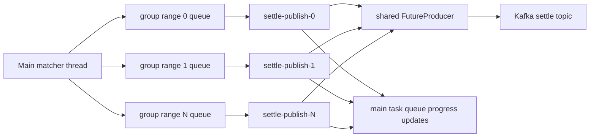

# Publish performance optimization

This document records the current downstream publish design after the settle
path was optimized for a multi-partition Kafka topic. The implementation lives
mainly in [`src/publish.rs`](../src/publish.rs), with configuration loaded from
[`config.yaml`](../config.yaml) through [`src/config.rs`](../src/config.rs).

## Goals

- Keep the matcher main thread single-owner for `Market`.
- Push the `settle` topic quickly across many partitions.
- Preserve strict ordering within each settle partition.
- Let different settle partitions advance independently.
- Avoid compatibility shims for older flat `output_publish` or optional settle
  idempotence configuration.

`quote_deals.<market>` remains a separate producer path. The optimization here
is focused on `settle`, whose messages are explicitly partitioned by user group.

## Previous bottleneck

Settle messages already had a stable partition key:

- `Market::settle_group_id(user_id)` maps a user to one of
  `USER_SETTLE_GROUP_SIZE` groups.
- `Market::next_settle_message_id(user_id)` increments a per-group
  `settle_message_id`.
- `enqueue_settle_publish` writes to the Kafka `settle` topic with
  `.partition(group_id)`.

The old publish loop collected a batch from one `std::sync::mpsc::Receiver`,
enqueued all messages in that batch, and then waited for all delivery futures in
that batch before processing the next batch. This allowed some concurrency
inside one batch, but a slow partition could hold the whole settle publish loop
back, including unrelated partitions.

## Current architecture

Settle publishing now runs a configured number of OS workers
(`output_publish.settle.thread_count`). The main thread sends each
`SettlePublishTaskInfo` directly to the worker responsible for that `group_id`.
Each worker owns an equal-sized contiguous range of settle groups, shares the
same Kafka `FutureProducer` handle, and keeps a bounded set of delivery futures
in flight on the same OS thread.

Each settle worker processes its queue as a delivery pipeline:

1. Drop already-pushed messages whose `settle_message_id` is not greater than
  the worker's local pushed cursor for that `group_id`.
2. Enqueue messages to Kafka until the local outstanding window is full.
3. Await delivery futures in enqueue order.
4. Decrement publish backlog and send `Task::SettleProgressUpdateTask` back to
  the main thread after each delivery confirmation.
5. Advance the worker's local enqueued cursor so duplicate queued messages are
  skipped before they enter Kafka.

Different workers run independently as plain OS threads, so one slow group range
does not block groups assigned to other settle publish workers.



## Ordering model

Ordering is guaranteed at the application layer by the group-to-worker mapping:

- Each `group_id` is always sent to the same worker queue.
- The main thread sends messages for a `group_id` in settle id order.
- A worker may enqueue later messages before earlier ones are acknowledged, but
  it awaits delivery futures in enqueue order before reporting progress.
- `pushed_settle_message_ids[group_id]` is updated only by the main thread after
  receiving `Task::SettleProgressUpdateTask`.

This keeps the persisted progress model simple: a pushed cursor means every
settle message up to that id for the same group has been delivered.

The design intentionally does not implement out-of-order per-partition delivery.
If a future version allows multiple in-flight messages per partition and accepts
out-of-order acknowledgements, progress cannot be represented by a single cursor
alone. It would need gap tracking, such as a contiguous cursor plus a bitmap or
set of acknowledged ids above the cursor.

## Kafka producer settings

`output_publish` is now split by producer:

```yaml
output_publish:
  quote:
    batch_size: 1024
    linger_ms: 10
    max_in_flight_requests_per_connection: 1
  settle:
    batch_size: 4096
    drain_batch_size: 4096
    max_outstanding: 16384
    linger_ms: 5
    max_in_flight_requests_per_connection: 5
    thread_count: 1
```

Settle publishing always enables Kafka idempotence and `acks=all` in code. There
is no `settle.enable_idempotence` flag anymore.

The Kafka `settle` topic partition count and `USER_SETTLE_GROUP_SIZE` must both
be integer multiples of `output_publish.settle.thread_count`.

Configuration meanings:

| Field | Scope | Effect |
| --- | --- | --- |
| `batch_size` | librdkafka `batch.num.messages` | Caps how many messages librdkafka may place in one broker batch. |
| `drain_batch_size` | Application queue drain | Caps how many publish tasks a settle worker tries to drain from its `mpsc` queue per loop while filling the outstanding window. |
| `max_outstanding` | Application delivery pipeline | Caps how many settle delivery futures one worker may keep in flight before waiting for the oldest delivery confirmation. |
| `linger_ms` | Kafka producer batching | Lets librdkafka wait briefly for nearby records before sending a broker batch. Lower values reduce latency; higher values may improve throughput. |
| `max_in_flight_requests_per_connection` | Kafka producer connection | Limits unacknowledged produce requests per broker connection. Settle must stay `<= 5` because idempotence is always enabled. |
| `thread_count` | Application settle publish workers | Controls how many OS threads drive settle publishing. Each worker owns `USER_SETTLE_GROUP_SIZE / thread_count` settle groups. |

Settle workers keep a bounded delivery pipeline: they continue draining queued
tasks into Kafka until `max_outstanding` is reached, then await delivery futures
in enqueue order and report progress back to the main thread. This keeps the
persisted cursor model simple while avoiding the old "enqueue one batch, wait for
the whole batch, then enqueue the next batch" throughput cliff.

## Thread model impact

The process now has `output_publish.settle.thread_count` OS threads named
`settle-publish-*`. Each worker blocks directly on Kafka delivery futures; there
is no nested `settle-pub-io` Tokio pool anymore.

The Kafka producer handle still owns its own librdkafka native threads for broker
I/O, polling, and protocol work. See [`doc/thread-model.md`](thread-model.md)
for the broader process thread model.

## Tuning guidance

Start with the current safe defaults:

- `settle.max_in_flight_requests_per_connection: 5`
- `settle.linger_ms: 5`
- `settle.batch_size: 4096`
- `settle.drain_batch_size: 4096`
- `settle.max_outstanding: 16384`
- `settle.thread_count: 1`

For lower latency, reduce `settle.linger_ms` first. If settle publishing falls
behind, increase `settle.max_outstanding` before increasing application thread
count; the shared settle `FutureProducer` is usually the limiting path.
For a conservative ordering experiment, set
`settle.max_in_flight_requests_per_connection: 1`; this may reduce throughput
but also reduces broker connection concurrency.

Use profiling before and after each change. The useful HTTP signals are:

- `/markets/{market}/status`: compare `pushed_settle_message_ids` against the
  settle message ids and watch per-group lag.
- `/markets/{market}/summary`: confirm the order book is not stalled while
  publishing catches up.

## Verification checklist

- `cargo check`
- `cargo test`
- Run the engine and confirm `/markets/{market}/status` shows
  `pushed_settle_message_ids[group_id]` advancing monotonically.
- Profile with `matchengine-xctrace-profile` and compare:
  - settle publish lag at the end of the run,
  - CPU in `settle-publish`,
  - librdkafka broker thread weight,
  - HTTP poll success window.

Expected behavior after the optimization:

- A slow or unavailable settle partition only grows that partition's backlog.
- Other settle partitions continue to deliver and update progress.
- The main matcher thread remains the only owner of `Market`.
- Recovery can still rely on one contiguous pushed cursor per settle group.
