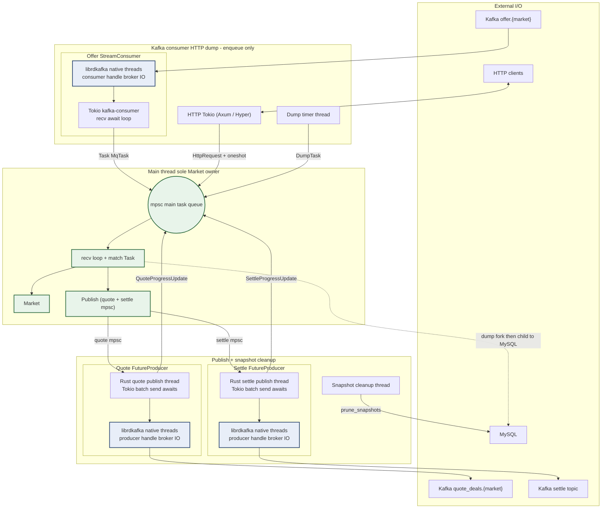
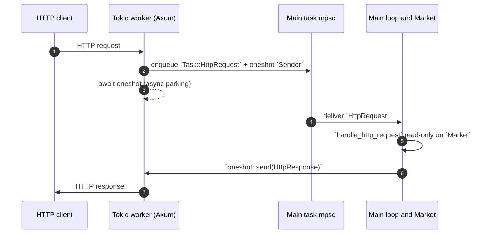
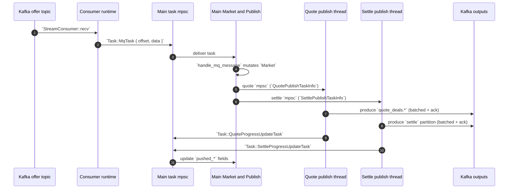

# Matching engine thread model

This document describes threads, async runtimes, message channels, and shared-state boundaries in the Rust matching-engine binary. Entry points live mainly in `src/main.rs`, publish workers in `src/publish.rs`, and HTTP forwarding in `src/http/server.rs`.

## Overall model

The process uses a **single market, single matcher main thread**: one engine serves one market; `Market` is owned only by the main thread. Any external event that reads or writes matcher state is turned into a `Task` and sent through `std::sync::mpsc` into the main thread’s serial event loop.

The goal is to avoid locks on the order book, order index, per-user order lists, and progress fields. Kafka input, HTTP queries, timed dumps, and publish acknowledgements do not touch `Market` directly; they send tasks to the main thread. The main thread processes tasks in receive order, so state changes follow the main loop’s ordering. **[Figures](#figures)** (topology + sequences) summarize the wiring between threads, queues, and Kafka/MySQL.

Profiling note: callers still use [`std::sync::mpsc::channel`](https://doc.rust-lang.org/std/sync/mpsc/index.html) in [`src/main.rs`](../src/main.rs). Some Rust toolchain builds report the blocking side as [`std::sync::mpmc::Receiver::recv`](https://doc.rust-lang.org/std/sync/mpmc/index.html) in sampled stacks—that is still the usual main-queue channel implementation, not a second queue type.

### Live corroboration: PID `60602` (`target/release/matchengine_rust`)

The following summarizes a **macOS** [`sample(1)`](https://keith.github.io/xcode-man-pages/sample.1.html) capture of the matcher at **PID 60602** on **2026-05-08** (approx. **2 s** dwell, **1 ms** sample interval): `sample 60602 2 …`. Stacks are illustrative; percentages are **sample counts**, not exact CPU shares.

Observed concurrent roles matched to code paths:

| What you see in stacks / Instruments | Likely source in code |
| --- | --- |
| **`com.apple.main-thread` → `matchengine_rust::main`** blocking in `Receiver::recv` → `thread::park` / `semaphore_wait_trap` | Main matcher loop awaiting the next [`Task`](../src/task.rs) ([`main` loop in `src/main.rs`](../src/main.rs)). |
| **`main`** while **not parked**: `handle_mq_message` → `market_put_limit_order` / `Publish::publish_put_order`; or **`handle_http_request`** → **`json_order_book`** / **`get_order_by_limit`** / **`Order::to_json`** | Same main loop handling `Task::MqTask` or [`Task::HttpRequest`](../src/task.rs)—no separate HTTP read/write thread touches `Market`. |
| **`std::thread` closure → `nanosleep` / `semwait`** (two idle threads most of the time) | Periodic [`snap_cleanup`](../src/snap_cleanup.rs) thread ([`spawn` ~L187](../src/main.rs)) and dump **timer** thread ([`spawn` ~L281](../src/main.rs)). Both only sleep/wake on an interval before enqueueing a [`Task`](../src/task.rs) on the main channel. |
| **`spawn_quote_publish_thread`**, often inside `collect_publish_batch` → **`Receiver::recv`** (parked waiting for **`QuotePublishTaskInfo`**) | Quote publish worker ([`spawn_quote_publish_thread` in `src/publish.rs`](../src/publish.rs)): OS thread drains the quote **mpsc**, batches, then awaits Kafka futures on its nested Tokio runtime. |
| **`spawn_settle_publish_thread`**, same pattern (`collect_publish_batch` → park on settle receiver); sometimes `FutureProducer::send_result` → `rd_kafka_producev` | Settle publish worker ([`spawn_settle_publish_thread`](../src/publish.rs)): OS thread draining settle **mpsc** and acknowledging after delivery futures complete. |
| **OS thread named `kafka-consumer`** in **`tokio` worker** parked on **`kevent`** | Dedicated consumer runtime configured with `.thread_name("kafka-consumer")` and `worker_threads(1)` ([`consumer_rt` in `src/main.rs`](../src/main.rs)); this thread runs the **`StreamConsumer::recv().await`** loop and forwards payloads as `Task::MqTask`. |
| **Many unnamed `tokio-runtime-worker`** threads**: mix of **`kevent`** (I/O multiplex) vs **`pthread_cond_wait` / `parking_lot`** (executor park) — one sample shard shows **Axum Serve / Hyper dispatch** servicing HTTP keep-alive | Mostly the **HTTP** Tokio **`Runtime::new()`** (full multi-thread scheduler in this crate): `http_thread` runs [`block_on`](https://docs.rs/tokio/latest/tokio/runtime/struct.Runtime.html#method.block_on) on Axum via [`serve_engine_http` in `src/http/server.rs`](../src/http/server.rs); plus auxiliary workers/blocking helpers from Kafka and each publish **`new_multi_thread`** runtime (below). |
| **One std thread** parked under **`tokio::runtime::Runtime::block_on`** with **no Axum/Hyper symbols** visible | Matches the **`thread::spawn`** that calls **`Runtime::new().expect(...).block_on(start_httpserver(...))`**: the **caller** thread blocks while the HTTP runtime’s workers accept connections. |
| **`rdk:main`**, **`rdk:broker-1`**, … | **librdkafka** background threads for the **StreamConsumer** and each **`FutureProducer`** (quote + settle build **two** producers in [`build_kafka_producer`](../src/publish.rs)). Names and counts depend on broker topology; they are **not** application threads for matcher logic. |

Tokio detail: **quote** and **settle** publish paths use **[`Builder::new_multi_thread().worker_threads(1)`](https://docs.rs/tokio/latest/tokio/runtime/struct.Builder.html)** ([`publish.rs`](../src/publish.rs)), but stacks may still show **`MultiThread::block_on`** and several generic **`tokio-runtime-worker`** entries because each runtime also brings up its **I/O driver / blocking pool** threads. That is expected and does **not** mean multiple matcher workers.

## Figures

The diagrams below summarize **who talks to whom** (channels / topics) and **where `Market` may be accessed** (single main thread only).

### Figure 1 — Process topology and channels

Solid arrows: recurring message paths. The dotted line is **not** the main-queue `Task` path: the main thread runs `handle_dump`, which **`fork`s** a child that talks to MySQL using a **fresh** pool.

**Kafka thread styling:** Boxes with **blue styling** (**`classDef rdkNative`**) are **native threads started inside librdkafka** (`rdk:main`, `rdk:broker-*`) for **that consumer or producer handle**. Neighbour boxes are **Rust** (`kafka-consumer` Tokio worker or publish `std::thread`) that drive rdkafka APIs. Boxes are schematic; thread **counts** vary with brokers, TLS, and librdkafka version. Narrative tables in [Kafka receive and send threads](#kafka-receive-and-send-threads-application-vs-librdkafka).

### Figure 2 — HTTP query: two threads, one `Market` reader

The important invariant: **`handle_http_request` runs on the main thread**; Tokio workers only shuffle the `Task` and wait on the oneshot.

### Figure 3 — Kafka input, matcher output, publish progress

## Runtime entities

### Main thread

The main thread loads config, validates Kafka topics, acquires the process lock, creates the MySQL pool, restores state, then constructs `Market` and `Publish`. In the event loop it blocks on `main_routine_receiver.recv()` and handles:

| Task | Source | Main-thread behavior |
| --- | --- | --- |
| `Task::MqTask` | Kafka consumer runtime | Calls `mainprocess::handle_mq_message`, advances input offset / sequence / matcher state, hands output to `Publish` |
| `Task::HttpRequest` | HTTP runtime | Read-only `Market`, builds JSON, returns via oneshot to the HTTP handler |
| `Task::DumpTask` | Timer thread | Calls `dump::handle_dump`, forks a child to write snapshots |
| `Task::QuoteProgressUpdateTask` | Quote publish thread | Updates `pushed_quote_deals_id` |
| `Task::SettleProgressUpdateTask` | Settle publish thread | Updates `pushed_settle_message_ids[group_id]` for that group |
| `Task::Terminate` | Reserved | Exits the main event loop |

`Market` uses non-thread-safe structures (`Rc<Order>`, `Cell`, `HashMap`, `OrderedSkipList`, …). They are not wrapped in `Arc<Mutex<_>>` and are not sent to other threads; that is the core invariant of this design.

### Kafka receive and send threads (application vs librdkafka)

The binary uses **one** [`StreamConsumer`](https://docs.rs/rdkafka/latest/rdkafka/consumer/struct.StreamConsumer.html) for `offer.<market>` input and **two** separate [`FutureProducer`](https://docs.rs/rdkafka/latest/rdkafka/producer/struct.FutureProducer.html) instances—quote and settle each call [`build_kafka_producer`](../src/publish.rs) once inside its own publish thread ([`spawn_quote_publish_thread`](../src/publish.rs), [`spawn_settle_publish_thread`](../src/publish.rs)). **Each of those three client handles has its own librdkafka thread set**; there is no single process-wide “Kafka I/O thread pool” shared across consumer + both producers.

**Does librdkafka create extra threads? Yes.** Aside from Rust’s **`kafka-consumer`** Tokio worker and the two **`std::thread`** publish loops, **`StreamConsumer::create`** / **`Producer::create`** (through this crate → **librdkafka**) each bring up **their own native (C-side) threads** that the application never names or spawns explicitly. Those threads handle broker sockets, timers, buffering, callbacks, protocol work, etc. Typical profiler labels include **`rdk:main`** and **`rdk:broker-<n>`**, but names and counts **vary by librdkafka version, bootstrap brokers, TLS, metadata, idle vs active state** — so this document does **not** fix a numeric thread budget; it only asserts that **each handle adds its own background threads on top** of whatever Tokio/`std::thread` you allocate in Rust.

**Receive path (offer topic → main `mpsc`):**

| Layer | Threads / code you own | What it does |
| --- | --- | --- |
| **Application** | Exactly **one** Tokio **worker** on a dedicated runtime: [`.worker_threads(1)` + `.thread_name("kafka-consumer")`](../src/main.rs). The spawned task loops, awaiting [`StreamConsumer::recv`](https://docs.rs/rdkafka/latest/rdkafka/consumer/stream_consumer/struct.StreamConsumer.html#method.recv) ([`.await`](https://doc.rust-lang.org/stable/std/keyword.await.html)) for each message. | Parks on the Tokio reactor / rdkafka futures until a record is ready, then forwards offset + payload as [`Task::MqTask`](../src/task.rs) on the main channel. Matcher logic stays off this thread. |
| **librdkafka** (this consumer handle only) | Native threads profiler users often label `rdk:main`, `rdk:broker-*`, … | Broker TCP, fetch/heartbeat work, buffering that ultimately feeds **`recv`**; not shared with HTTP, and **not** the same `rdk:*` threads as either producer. |

**Send path (`quote_deals.<market>` and `settle`):**

| Layer | Quote | Settle |
| --- | --- | --- |
| **Application** | One dedicated **`std::thread`** loop; inside it a Tokio runtime **[`worker_threads(1)`](../src/publish.rs)** runs `producer.send_result` / awaits [`DeliveryFuture`](https://docs.rs/rdkafka/latest/rdkafka/producer/producer_arc/struct.DeliveryFuture.html)s for batches. | Same layout: **separate** `std::thread` + **another** Tokio runtime with **`worker_threads(1)`**. |
| **librdkafka** | Background threads for **that** `FutureProducer` only (again `rdk:*` in stacks). | **Different** `FutureProducer` instance → **its own** `rdk:*` set, not shared with quote or with the consumer. |

So: **“Receive”** in product terms is *broker → librdkafka fetch side → your `kafka-consumer` thread’s `recv` loop → `MqTask`*. **“Send”** is *your publish thread enqueues via `send_result` → librdkafka serializes and pushes bytes → broker*; delivery completion completes the future your thread awaits.

### Kafka consumer runtime

`src/main.rs` builds the consumer runtime described in the **Receive path** row above. It assigns **partition 0** of `offer.<market>` at `Market.input_offset + 1` after restore and uses a fresh `group.id` per run. It does not run matching; it only wraps Kafka offset and payload in `Task::MqTask` and sends that to the main thread.

### HTTP thread

An OS thread **`spawn`s** a [`Runtime::new()`] default **multi-thread** Tokio runtime (`tokio` **`full`** in `Cargo.toml`), then **`block_on`s** Axum. Each handler turns the request into `HttpOp`, creates a `tokio::sync::oneshot` reply channel, and sends `Task::HttpRequest` to the main thread.

The handler awaits the oneshot on a **worker** thread; [`handle_http_request`](../src/http/handlers.rs) still runs **only** on the main thread when that [`Task::HttpRequest`](../src/task.rs) is dispatched. In profilers you may see many **`tokio-runtime-worker`** stacks (I/O + executor park) and even **Axum/Hyper** parsing on workers, but **no concurrent `Market` access** off the main thread. Because the main thread serializes matching with HTTP work, responses see a consistent snapshot with Kafka, dumps, and publish progress in the same stream—but slow main-thread work queues HTTP latency.

[`Runtime::new()`]: https://docs.rs/tokio/latest/tokio/runtime/struct.Runtime.html#method.new

### Timer / dump thread and forked child

The timer thread sends `Task::DumpTask` every `snap_dump.dump_interval_secs`. On dump, the main thread calls `dump::handle_dump`, which `fork()`s:

1. The parent returns immediately; the main thread keeps processing tasks.
2. The child inherits a memory snapshot at fork time, creates a **new** MySQL pool, writes orders and progress to snapshot tables, then `process::exit(0)`.

Snapshot semantics come from copy-on-write at fork: the child sees `Market` as of the fork instant. The code avoids reusing the parent MySQL pool in the child to prevent duplicated TCP sockets and MySQL packet sync issues.

### Publish threads

`Publish::new` creates two unbounded mpsc channels and starts two OS threads:

| Thread | Main-thread output consumed | Kafka target | Progress reported back |
| --- | --- | --- | --- |
| Quote publish thread | Matcher-built `QuotePublishTaskInfo` | `quote_deals.<market>` | `Task::QuoteProgressUpdateTask` |
| Settle publish thread | Matcher-built `SettlePublishTaskInfo` | `settle` topic, chosen partition | `Task::SettleProgressUpdateTask` |

These threads take **already processed** matcher outputs from the main event loop, push them to Kafka, and after delivery confirmation use `main_routine_sender` to report progress so the main thread updates `Market` `pushed_*` fields.

Each thread is the **application send driver** for its own `FutureProducer`; the **librdkafka send / broker I/O threads** for that producer are separate (see [Kafka receive and send threads](#kafka-receive-and-send-threads-application-vs-librdkafka)). Tasks are batched per config; delivery futures are still awaited in pending order. Producers set `max.in.flight.requests.per.connection = 1` to reduce reordering risk.

Publish threads hold only data needed to send plus `Arc<PublishBacklog>`. Backlog uses atomic counters for quote/settle/per-group pending counts—mostly accounting and debug underflow checks; the main thread does not use backlog for flow control today.

### Snapshot cleanup thread

At startup a thread runs periodically (`snap_cleanup.cleanup_interval_secs`) and calls `snap_cleanup::prune_snapshots` with a cloned pool. It does not touch `Market`, only the database.

## Message and state flow

### Input path

1. Kafka consumer reads `offer.<market>` payload.
2. It sends `Task::MqTask { offset, data }` to the main thread.
3. Main thread bumps `oper_id` and `input_offset`; `input_sequence_id` must be strictly consecutive.
4. Matcher logic updates books, indexes, deal ids, message ids, and per-group settle message ids.
5. Quote / settle outputs are sent to the respective publish threads.

Input sequence checks are central: stale ids are skipped; gaps reject processing so the state machine cannot skip missing input.

### Output path

The matcher thread does not block on Kafka. During matching it calls `Publish` and enqueues completed outputs on quote or settle channels. After Kafka delivery, publish threads send “how far we have published” back to the main thread.

So `Market` tracks two output notions:

| Fields | Meaning |
| --- | --- |
| `deals_id` / `settle_message_ids` | What the matcher has **generated** |
| `pushed_quote_deals_id` / `pushed_settle_message_ids` | What publish has **acked** from Kafka |

Snapshots store both. On restore, the code picks a snapshot compatible with already-published progress, avoiding “state includes output that was never reliably published.”

### HTTP query path

HTTP does not lock `Market`; it queues on the main thread for a synchronous read. That eliminates concurrent read/write races; latency depends on queue depth and per-task cost (including Kafka and dumps).

### Dump path

Dump tasks queue like everything else—serial with Kafka, HTTP, and publish progress until `handle_dump` runs; after fork the parent returns immediately while the child writes from its memory copy.

## Concurrency boundaries

### Not shared across threads

- `Market` is read/written only on the main thread.
- `Order` uses `Rc` and `Cell` on the main thread (and in the fork child), not sent across threads.
- HTTP handlers hold `mpsc::Sender<Task>`, not `&Market`.
- The Kafka consumer does not apply business logic; it forwards payloads only.

### May be shared

- Cloned `mpsc::Sender<Task>` for many producers into the main queue.
- MySQL `Pool` cloned for snapshot cleanup; the dump **child** creates its own pool.
- `PublishBacklog` via `Arc` and atomics between publish threads and `Publish` on the main thread side.

## Ordering

### Main-thread queue

All tasks share one FIFO channel. Per-sender order is preserved; interleaving across senders is scheduler-dependent. `input_sequence_id` on the matcher side still enforces a contiguous input state machine even if delivery order vs other tasks varies.

### Kafka input

The consumer assigns only partition 0 of `offer.<market>` and continues from the restored offset. Upstream must put this market’s input on that partition with contiguous `input_sequence_id` for correct processing.

### Kafka output

Quote and settle publish on separate threads:

- One quote publisher to `quote_deals.<market>`.
- One settle publisher writing partitions of `settle` by `user_id % 64`.
- Each producer uses `max.in.flight.requests.per.connection = 1` and reports progress only after delivery ack.

There is no single global settle ordering; ordering is per group/partition, matching `settle_message_ids[group_id]`.

## Risks and caveats

1. The main thread is the bottleneck for matching, HTTP reads, dump triggers, and progress updates—any long task stalls others.
2. `std::sync::mpsc::channel` is unbounded; backlog from Kafka, HTTP, or publishing has no explicit backpressure and can grow memory.
3. Publish threads `panic!` on failure; there is no unified supervisor or graceful shutdown.
4. `Task::Terminate` only stops the main loop; timer, HTTP, consumer, and publish loops are long-running—exit is incomplete.
5. `fork()` runs in a multi-threaded process. The child is kept minimal (new pool, quick exit); adding extra work in the child needs a fresh fork-safety review.
6. HTTP shares the main queue with matching—consistent reads, but heavy querying adds matcher latency.
7. Runtime profilers show **many** `tokio-runtime-worker` / **`rdk:*`** threads across HTTP, consumer, publish producers, and executor internals; that is **not** parallel order-book matching—[`Market`](../src/market.rs) ownership remains on **one** thread (see § *Live corroboration: PID `60602`*).
## Maintenance notes

- New features that touch `Market` should become new `Task`s on the main thread; avoid `Arc<Mutex<Market>>` across threads.
- For throughput, prefer batched input, output backpressure, bounded publish channels, and HTTP throttling—not splitting the book across matcher threads.
- For multiple markets, keep one `Market` owner per market (multi-loop process or multi-process) and define Kafka partition ownership per market.
- For clean shutdown, add stop signals to consumer, HTTP, timer, and publish loops, and decide whether the main thread drains publish backlog before exit.
